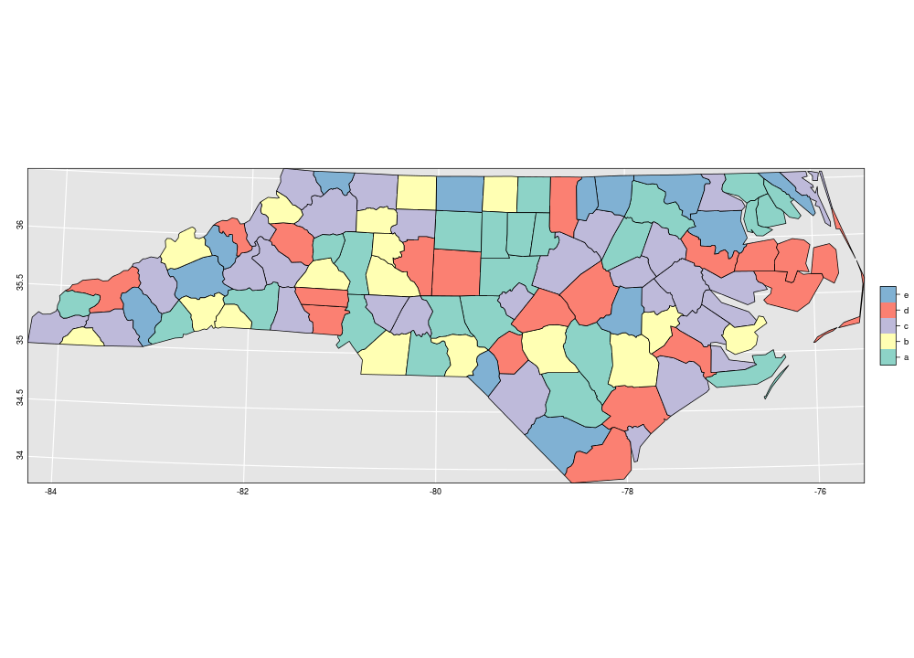
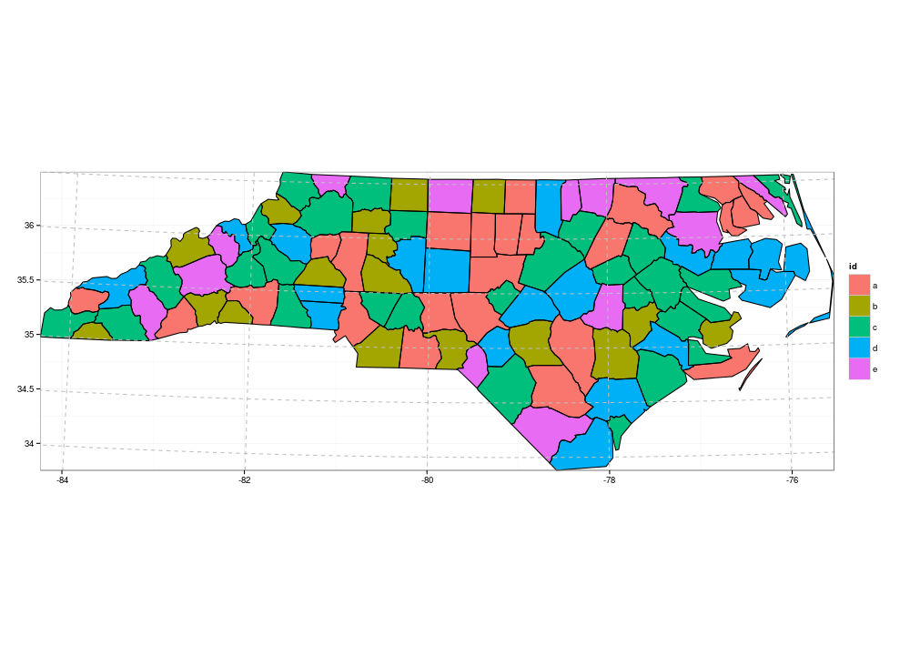
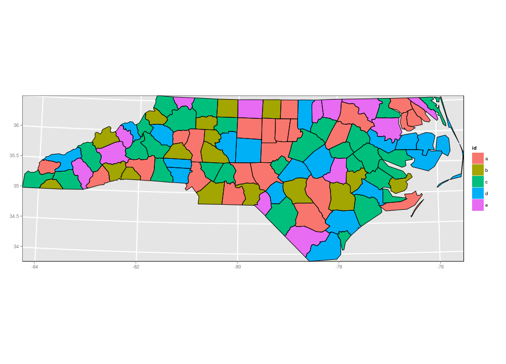

## Add graticules to projected maps in R

### install the package

```r
devtools::install_github('jmlondon/ProjectedGridlines', subdir = 'ProjectedGridlines')
```

### spplot example:

From [R-sig-Geo](https://stat.ethz.ch/pipermail/r-sig-geo/attachments/20101208/ba706f4c/attachment.pl).

```r
library(ProjectedGridlines)
library(sp)
library(rgdal)
library(maptools)
library(RColorBrewer)
library(lattice)

#read in the maptools north carolina shapefile, unprojected
d <- readShapePoly(system.file("shapes/sids.shp", package="maptools")[1], proj4string=CRS("+proj=longlat +datum=NAD27"))

# create a dummy factor variable, with equal labels:
set.seed(31)
d$f = factor(sample(1:5,100,replace=T),labels=letters[1:5])

#specify a custom Albers equal centered on the coordinate data
#this works for points and polygons, but lines need to be converted to points
med.lat <- round(median(coordinates(d)[,2]))
med.lon <- round(median(coordinates(d)[,1]))
lat1<-bbox(d)[2,1]+diff(range(bbox(d)[2,]))/3
lat2<-bbox(d)[2,2]-diff(range(bbox(d)[2,]))/3

myProj <- paste("+proj=aea +lat_1=",lat1," +lat_2=",lat2," +lat_0=",med.lat,
                " +lon_0=", med.lon, "+x_0=0 +y_0=0 +ellps=GRS80 +datum=NAD83 +units=m",sep="")

#project the data, the graticule lines. note the gridlines function calls the unprojected data
d.proj <- spTransform(d,CRS(myProj))
#grat.lines<-spTransform(gridlines(d,ndisc=500),CRS(myProj))
g<-GetGratLines(d,myProj,list(t=0.25,b=-0.25,l=-0.25,r=0.25))
#create the sp.layout component for the graticule lines
grat.plot<-list("sp.lines",g,lwd="1.5",col="white",first=TRUE)

x_grat_at<-GetLabelCoords(g,offset=list(ew=0))$EW_Coords

y_grat_at<-GetLabelCoords(g,offset=list(ns=0))$NS_Coords

x_grat<-list(draw=TRUE,
             at=x_grat_at,
             labels=as.character(GetDegreeLabels(d)$EW_Labels),
             tck=c(0,0),
             cex=0.75)

y_grat<-list(draw=TRUE,
             at=y_grat_at,
             labels=as.character(GetDegreeLabels(d)$NS_Labels),
             rot=90,
             tck=c(0,0),
             cex=0.75)

spplot(d.proj, c("f"), 
       panel=function(...){
           panel.fill(col="gray90")
           panel.polygonsplot(...)
       },
       sp.layout=list(grat.plot),
       col.regions=brewer.pal(5, "Set3"),scales=list(x=x_grat,y=y_grat))
```




### ggplot2 example

```r
library(ProjectedGridlines)
library(sp)
library(rgdal)
library(maptools)
library(RColorBrewer)
library(ggplot2)
library(grid)

#read in the maptools north carolina shapefile, unprojected
d <- readShapePoly(system.file("shapes/sids.shp", package="maptools")[1], proj4string=CRS("+proj=longlat +datum=NAD27"))

# create a dummy factor variable, with equal labels:
set.seed(31)
d$f = factor(sample(1:5,100,replace=T),labels=letters[1:5])

#specify a custom Albers equal centered on the coordinate data
#this works for points and polygons, but lines need to be converted to points
med.lat <- round(median(coordinates(d)[,2]))
med.lon <- round(median(coordinates(d)[,1]))
lat1<-bbox(d)[2,1]+diff(range(bbox(d)[2,]))/3
lat2<-bbox(d)[2,2]-diff(range(bbox(d)[2,]))/3

myProj <- paste("+proj=aea +lat_1=",lat1," +lat_2=",lat2," +lat_0=",med.lat,
                " +lon_0=", med.lon, "+x_0=0 +y_0=0 +ellps=GRS80 +datum=NAD83 +units=m",sep="")

#project the data, the graticule lines. note the gridlines function calls the unprojected data
d.proj <- spTransform(d,CRS(myProj))
coordLim <- bbox(d.proj)
grat <- GetGratLines(d,myProj,list(t=0.25,b=-0.25,l=-0.25,r=0.25))
# There is no fortify method in ggplot2 for objects of class SpatialLines, which is why we create a SpatialLinesDataFrame, with dummy @data slot
gratdf <- SpatialLinesDataFrame(grat, data = data.frame(rep(NA, length(grat))), match.ID = FALSE)

## Get x, y labels and locations
x_grat_at<-GetLabelCoords(grat,offset=list(ew=0))$EW_Coords

y_grat_at<-GetLabelCoords(grat,offset=list(ns=0))$NS_Coords

x_grat<-list(draw=TRUE,
             at=x_grat_at,
             labels=as.character(GetDegreeLabels(d)$EW_Labels),
             tck=c(0,0),
             cex=0.75)

y_grat<-list(draw=TRUE,
             at=y_grat_at,
             labels=as.character(GetDegreeLabels(d)$NS_Labels),
             rot=90,
             tck=c(0,0),
             cex=0.75)


# Convert spatial objects to ggplot ready dataframes
ggd.proj <- fortify(d.proj, region = "f")
ggcontour <- fortify(d.proj, region = "NAME") # Otherwise adjacent polygons containing the save factor level are merged
gggrat <- fortify(gratdf)


ggplot(ggd.proj) +
    geom_polygon(aes(x=long, y=lat, group=group, fill = id)) +
    geom_polygon(data = ggcontour, aes(x=long, y=lat, group=group), fill = NA, colour = 'black') +
    geom_path(data = gggrat, aes(x=long,y=lat,group=group), col = 'grey', linetype = 'dashed') +
    coord_equal(xlim = coordLim[1,], ylim = coordLim[2,]) +
    scale_x_continuous(name = 'Lat', breaks = x_grat$at, labels = x_grat$labels) +
    scale_y_continuous(name = 'Long', breaks = y_grat$at, labels = y_grat$labels) +
    theme_bw() +
    theme(axis.title = element_blank())
```



```r
ggplot(ggd.proj) +
    geom_path(data = gggrat, aes(x=long,y=lat,group=group), col = 'white', size = 1) +
    geom_polygon(aes(x=long, y=lat, group = group, fill = id)) +
    geom_polygon(data = ggcontour, aes(x=long, y=lat, group=group), fill = NA, colour = 'black') +
    coord_equal(xlim = coordLim[1,], ylim = coordLim[2,]) +
    scale_x_continuous(name = 'Lat', breaks = x_grat$at, labels = x_grat$labels) +
    scale_y_continuous(name = 'Long', breaks = y_grat$at, labels = y_grat$labels) +
    theme(panel.grid = element_blank(), panel.border = element_rect(colour = "black", fill = NA), axis.title = element_blank())
```



